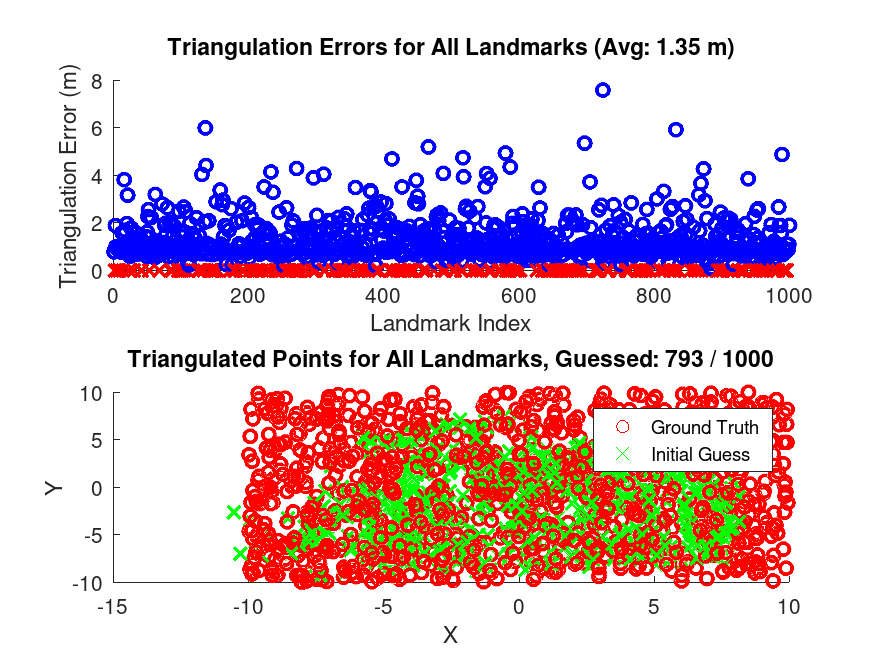
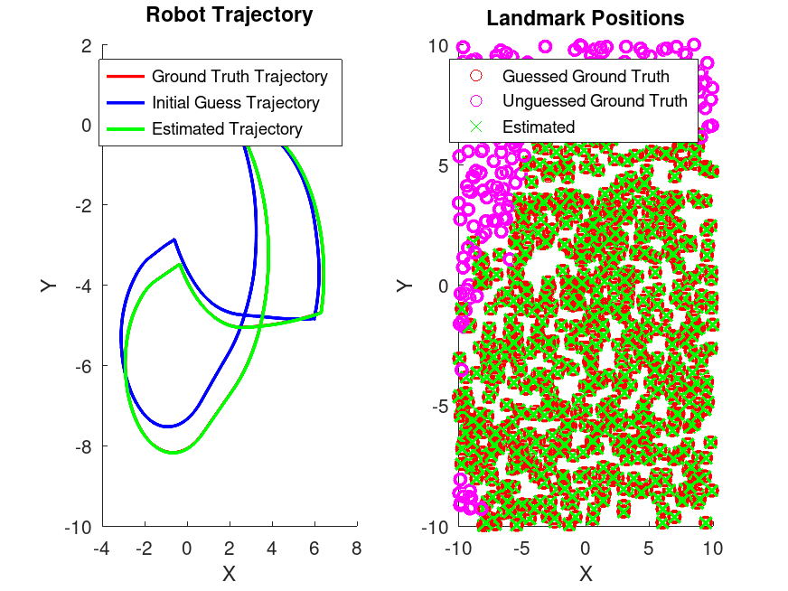
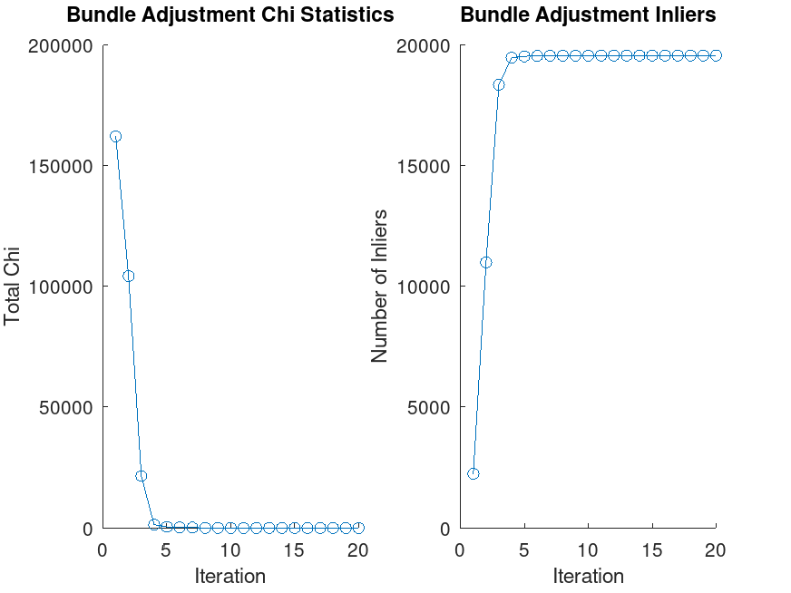
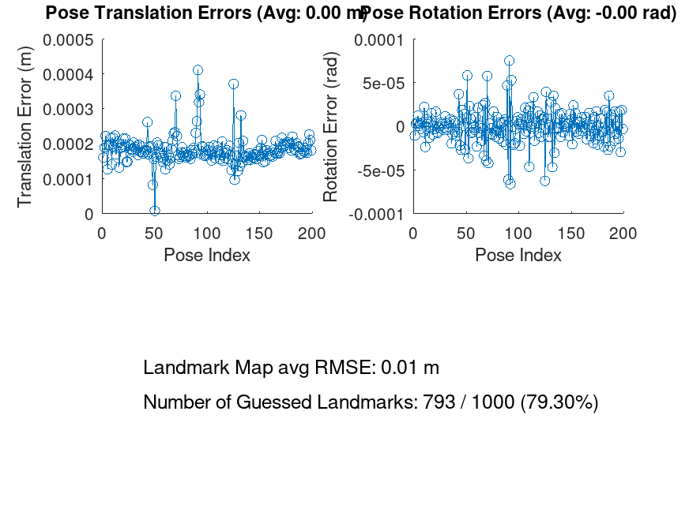
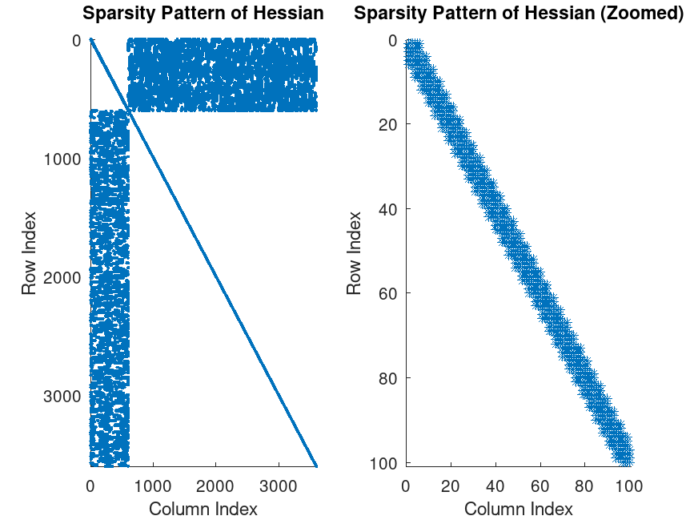

<div align="center">
<h1 style="border-bottom: none; margin-bottom: 0;">
Planar Monocular SLAM</h1>
<p style="font-size: 1.2em; color: #555;"><strong>Supervisors:</strong> Prof. G. Grisetti and PhD L. De Rebotti</p>

<p><i>A Bundle Adjustment approach for Simultaneous Localization and Mapping using a Differential Drive Robot.</i></p>
</div>


## Description

In this project, a differential drive robot is equipped with a monocular camera. The camera has a fixed known pose $`\mathbf{T}_{cam}`$ with respect to the robot's base frame and known intrinsic parameters $`\mathbf{K}`$. The system processes the recordings of a trajectory consisting of:
- Odometry of the wheels (relative transformations between consecutive poses).
- A stream of landmark projections tracked by the monocular camera, with known data associations.

The goal of the project is to perform SLAM (Simultaneous Localization and Mapping) to reconstruct both the trajectory of the robot and a 3D map of the environment populated with the observed landmarks.

# Methodology 

The problem is modeled as a factor graph and solved using Bundle Adjustment (BA), a non-linear least squares optimization technique, after establishing a robust initial estimation of the state.

### Qualifying the Domain
The state vector $`\mathbf{x}`$ is composed of the robot's poses and the map's landmarks:
- <b>Robot Poses</b>: $`\mathbf{X}_R \in SE(2)^N`$, where $`N=200`$ is the number of poses. Since it is a planar differential drive, the active degrees of freedom are 3 ($`x, y, \theta`$).
- <b>Landmark Positions</b>: $`\mathbf{X}_L \in \mathbb{R}^{3 \times M}`$, where $`M=1000`$ is the number of landmarks.

The measurements $`\mathbf{Z}`$ are of two types:
- <b>Pose-to-Pose</b> (Odometry): $`h_i(\mathbf{x}) = \mathbf{X}_{R_i}^{-1} \mathbf{X}_{R_{i+1}}`$
- <b>Pose-to-Landmark</b> (Camera): $`h_{ij}(\mathbf{x}) = \pi(\mathbf{K} \cdot \mathbf{T}_{cam}^{-1} \cdot \mathbf{X}_{R_i}^{-1} \cdot \mathbf{X}_{L_j})`$


## Initial Estimate

Before running the non-linear optimization, an initial guess for the landmarks is computed via the average of triangulations. This provides a robust starting point, allowing Bundle Adjustment to converge reliably without getting stuck in local minima.
For each pair of 2D pixel observations $`\mathbf{u}_1`$ and $`\mathbf{u}_2`$ of the same landmark from two different robot poses $`\mathbf{X}_1`$ and $`\mathbf{X}_2`$, we compute the world-to-pixel projection matrices $`\mathbf{P}_1, \mathbf{P}_2 \in \mathbb{R}^{3 \times 4}`$:

```math
\mathbf{P}_i = \mathbf{K} \;[\;\mathbf{I}\; | \;\mathbf{0}\;]\; (\mathbf{X}_i \cdot \mathbf{T}_{cam})^{-1}
```

Using the Direct Linear Transformation (DLT) method, the geometric relationship dictates that the cross product of the measured 2D point and the projected 3D point must be zero. This yields a homogeneous linear system $`\mathbf{A}\tilde{\mathbf{p}} = \mathbf{0}`$, where $`\tilde{\mathbf{p}} = [X, Y, Z, 1]^T`$ is the homogeneous 3D landmark position:

```math
\mathbf{A} = \begin{bmatrix} 
u_{1,x} \mathbf{p}_{1,3}^T - \mathbf{p}_{1,1}^T \\ 
u_{1,y} \mathbf{p}_{1,3}^T - \mathbf{p}_{1,2}^T \\ 
u_{2,x} \mathbf{p}_{2,3}^T - \mathbf{p}_{2,1}^T \\ 
u_{2,y} \mathbf{p}_{2,3}^T - \mathbf{p}_{2,2}^T 
\end{bmatrix}
```

(where $`\mathbf{p}_{i, j}^T`$ denotes the $`j`$-th row of the projection matrix $`\mathbf{P}_i`$)

This system is solved using Singular Value Decomposition (SVD), $`\mathbf{A} = \mathbf{U} \mathbf{\Sigma} \mathbf{V}^T`$. The solution for $`\tilde{\mathbf{p}}`$ corresponds to the last column of $`\mathbf{V}`$. Finally, the 3D point is dehomogenized by dividing by its 4th coordinate to obtain the world coordinates.

<div align="center">
<p><i>Figure 1: Initial guess obtained through multiple-view triangulation.</i></p></div>

## Box-Plus Operator
Because our state variables lie on different mathematical manifolds ($`SE(2)`$ for poses and $`\mathbb{R}^3`$ for landmarks), we cannot use standard vector addition for the entire state. Instead, we use the $`\boxplus`$ (box-plus) operator.

1. Robot Poses ($`SE(2)`$):
The perturbation vector for the $`i`$-th pose, $`\Delta \mathbf{x}_{R_i} \in \mathbb{R}^3`$, represents a twist in the local tangent space. We map this tangent vector to a transformation matrix in $`SE(2)`$ using the exponential map (denoted as v2t in the implementation) and apply it via left multiplication:
```math
\mathbf{X}_{R_i} \leftarrow \exp_{SE(2)}(\Delta \mathbf{x}_{R_i}) \cdot \mathbf{X}_{R_i}
```

2. Landmarks ($`\mathbb{R}^3`$):
The landmarks reside in a standard Euclidean space. Therefore, the perturbation vector $`\Delta \mathbf{x}_{L_j} \in \mathbb{R}^3`$ is simply added to the current estimate:
```math
\mathbf{X}_{L_j} \leftarrow \mathbf{X}_{L_j} + \Delta \mathbf{x}_{L_j}
```

## Errors and Jacobians

To solve the non-linear least squares problem, we must define the error functions $`\mathbf{e}(\mathbf{x})`$ and their corresponding Jacobians $`\mathbf{J}`$ with respect to the state perturbations $`\Delta \mathbf{x}`$. The error functions quantify the discrepancy between the predicted measurements (based on the current state estimate) and the actual measurements, while the Jacobians capture how small changes in the state affect these errors. The Jacobian is defined as:

```math
\mathbf{J} = \left. \frac{\partial \mathbf{e}(\mathbf{x} \boxplus \Delta \mathbf{x})}{\partial \Delta \mathbf{x}} \right|_{\Delta \mathbf{x} = 0}
```

where $`\Delta \mathbf{x}`$ is the perturbation applied to the state variables.

### 1. Pose-to-Pose

<b>Odometry Error.</b>
The pose-to-pose error computes the difference between the expected relative transformation $`\hat{\mathbf{Z}} = \mathbf{X}_i^{-1} \mathbf{X}_j`$ and the measured odometry $`\mathbf{Z}`$. Because the state evolves in $`SE(2)`$, the error $`\mathbf{e}_{pose} \in \mathbb{R}^{12}`$ flattens the $`3 \times 3`$ rotation matrix and the $`3 \times 1`$ translation vector differences:

```math
\mathbf{e}_{pose} = \begin{bmatrix} \text{vec}(\hat{\mathbf{R}}_{ij} - \mathbf{R}_z) \\ \hat{\mathbf{t}}_{ij} - \mathbf{t}_z \end{bmatrix}
```


Using chordal distance for the rotation error avoids the need for the $`\boxminus`$ (box-minus) operator. By embedding rotations in a flattened vector, the Jacobians become simpler to derive and implement. This trades a small modeling approximation for clearer, more stable Jacobians and reduced implementation complexity.


<b>Odometry Jacobians.</b>
The perturbation is $`\Delta \mathbf{x} = [\Delta x, \Delta y, \Delta \theta]^T`$. The Jacobian $`\mathbf{J}_j`$ with respect to pose $`\mathbf{X}_j`$ is a $`12 \times 3`$ matrix. Since $`\mathbf{X}_i`$ and $`\mathbf{X}_j`$ are strongly coupled, the Jacobian with respect to $`\mathbf{X}_i`$ simplifies to $`\mathbf{J}_i = -\mathbf{J}_j`$.

```math
 \mathbf{J}_j = \begin{bmatrix}
\mathbf{0}_{9 \times 2} & \text{vec}(\mathbf{R}_i^T \mathbf{R}'_{z0} \mathbf{R}_j) \\ \mathbf{R}_i^T(:, 1:2) & (-\mathbf{R}_i^T [\mathbf{t}_{ij}]_\times)_{(:, 3)}\end{bmatrix}
```

where $`\mathbf{R}'_{z0}`$ is the derivative of the rotation matrix wrt $`\theta`$ along the Z-axis computed in 0, and $`[\cdot]_\times`$ is the skew-symmetric matrix.

### 2. Pose-to-Landmark

<b>Projection Error.</b>
The pose-to-landmark error is the standard reprojection error. It compares the measured pixel coordinates $`\mathbf{u}_{\mathrm{obs}}`$ with the predicted projection $`\hat{\mathbf{z}}`$:

```math
\mathbf{p}_{\mathrm{cam}} =
\begin{bmatrix} p_x \\ p_y \\ p_z \end{bmatrix}
= \mathbf{T}_{\mathrm{cam}}^{-1}\,\mathbf{X}_r^{-1}\,\mathbf{X}_l
```

```math
\hat{\mathbf{z}} = \pi\big(\mathbf{K}\,\mathbf{p}_{\mathrm{cam}}\big)
=
\begin{bmatrix}
\frac{f_x p_x + c_x p_z}{p_z} \\
\frac{f_y p_y + c_y p_z}{p_z}
\end{bmatrix}
```

```math
\mathbf{e}_{\mathrm{proj}} = \hat{\mathbf{z}} - \mathbf{u}_{\mathrm{obs}}
```

<b>Projection Jacobians.</b>
Using the chain rule, the Jacobians with respect to the robot pose ($`SE(2)`$) and the landmark position ($`\mathbb{R}^3`$) are:

```math
\mathbf{J}_{\mathrm{pose}}
= \frac{\partial \mathbf{e}_{\mathrm{proj}}}{\partial \mathbf{X}_r}
= \mathbf{J}_p \,\mathbf{K}\,\mathbf{J}_{\mathbf{w}r}
```

```math
\mathbf{J}_{\mathrm{landmark}}
= \frac{\partial \mathbf{e}_{\mathrm{proj}}}{\partial \mathbf{X}_l}
= \mathbf{J}_p \,\mathbf{K}\,\mathbf{J}_{\mathbf{w}l}
```

Where $`\mathbf{J}_p`$ is the derivative of the perspective division:

```math
\mathbf{J}_p =
\begin{bmatrix}
\frac{1}{p_z} & 0 & -\frac{p_x}{p_z^2} \\
0 & \frac{1}{p_z} & -\frac{p_y}{p_z^2}
\end{bmatrix}
```

And the intermediate derivatives are (written to emphasize blocks and vector orientation):

```math
\mathbf{J}_{\mathbf{w}r}
=
\begin{bmatrix}
-\mathbf{R}_{\mathrm{cam}}^{-1}\,\mathbf{R}_r^{-1}(:,\,1:2)
&\; | \; &
\mathbf{R}_{\mathrm{cam}}^{-1}\,\mathbf{R}_r^{-1}
\begin{bmatrix} X_l^{(y)} \\ -X_l^{(x)} \\ 0 \end{bmatrix}
\end{bmatrix}
```

```math
\mathbf{J}_{\mathbf{w}l} = \mathbf{R}_{\mathrm{cam}}^{-1}\,\mathbf{R}_r^{-1}
```

# Results
The Bundle Adjustment was performed using a damping factor of 1e-6 and a Huber/Cauchy kernel with a kernel_threshold of 1. The optimization yielded excellent metric results, successfully mapping the planar environment and correcting the odometry drift.

### Performance Metrics
| Metric | Value | Notes |
|---|---:|---|
| Bundle Adjustment Iterations | **7** | Number of optimization iterations |
| Landmarks Estimated | **79.40%** <br> `█████████░░` | Fraction of landmarks successfully initialized |
| Landmark RMSE | **0.01 m** | Root-mean-square error on landmarks |
| Mean Translational Error | **0.002 m** | Mean absolute translational error |
| Mean Rotational Error | **~1e-5 rad** | Mean absolute rotational error |


### Graphical Analysis

<div align="center">

<table>
    <tr>
        <td align="center" width="50%"><p><b>Final Map & Trajectory: </b> Overlay of the optimized graph vs Ground Truth.</p></td>
        <td align="center" width="50%"><p><b>Convergence: </b> Evolution of the chi² error over optimization iterations.</p></td>
    </tr>
    <tr>
        <td align="center" width="50%"><p><b>Pose Errors: </b> Distribution of translational and rotational absolute errors.</p></td>
        <td align="center" width="50%"><p><b>Hessian Sparsity: </b> Visualizing the sparse block structure of the system HΔx = −b.</p></td>
    </tr>
</table>

</div>


